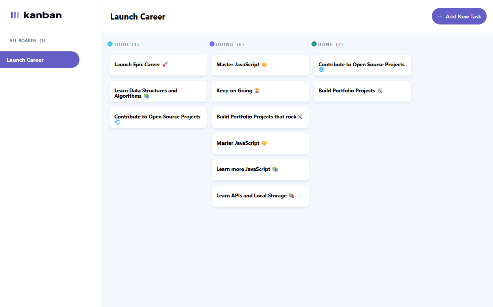
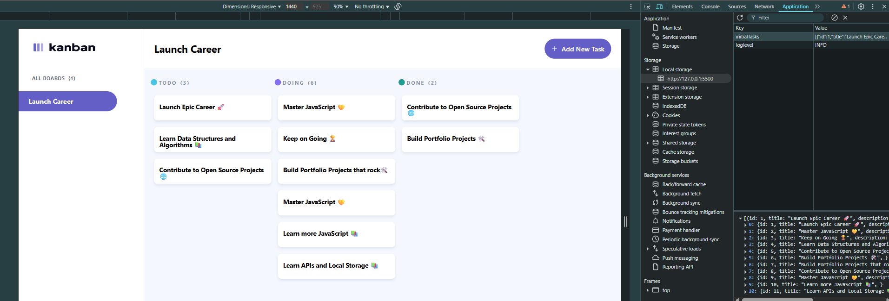
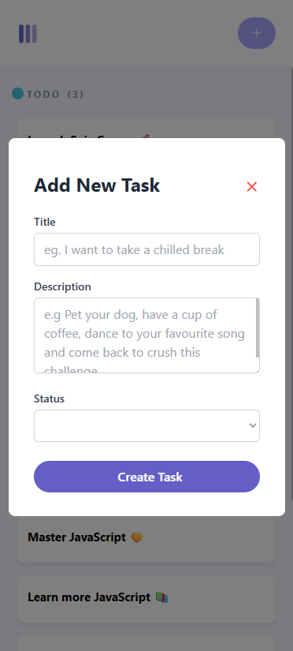

# JSL05 Project Brief: Task Board with Local Storage Persistence and Task Creation

## Overview

In this project, I implemented a task management system where **tasks are persisted in local storage**, ensuring that tasks remain available even after refreshing the page or reopening the application. Users will be able to **add new tasks**, with the task details being **stored in local storage** and displayed in the appropriate **columns** ("To Do", "Doing", "Done"). The application should also include an **Add Task** modal for creating new tasks.

## Key Objectives

### Persistent Task Storage & Retrieval

- **Save tasks to local storage**: On page load, the application should **load tasks** from local storage so that the latest task list is available, even after a refresh.
- Ensure that **tasks are saved in local storage** every time a new task is added so that tasks persist after the page refreshes.
- **Load tasks** from local storage on startup, so users can see the latest tasks without manually re-entering them.
- Tasks should be categorized correctly into their respective columns (e.g., "To Do", "Doing", "Done") based on their **status** when loaded from local storage.

### Task Creation & Modal Interaction

- Provide an **"Add Task" button** that, when clicked, opens a **modal** for creating a new task.
- The modal should include:
  - Fields for entering the **task title** and **description**.
  - A dropdown to select the task **status** ("To Do", "Doing", "Done").
  - A **submit button** to add the new task to the task board immediately.
- After submitting, the task should appear on the board without requiring a page refresh.

## Design & Responsiveness

- The **"Add New Task" modal** should match the [Figma design](https://www.figma.com/design/y7bFCUYL5ZHfPeojACBXg2/Challenges-%7C-JSL?node-id=0-1&p=f&t=NNqgDPlU1PNLLh8i-0), including mobile-responsive behavior.
- Ensure that the modal and task board are **fully responsive** and function properly on both desktop and mobile devices.
- The "Add Task" button should **transform** appropriately on mobile devices to match the Figma design.

## Code Structure & Maintainability

- **Modularize your JavaScript code**: Break your code into separate modules, each handling a **single responsibility** (e.g., local storage handling, task rendering, modal management).
- Use **descriptive variable and function names** to ensure the code is clear and easy to maintain.
- Include **JSDoc comments** for every major function and module to describe their functionality, parameters, and return values.

## List of technologies

- HTML
- Tailwind CSS
- Javascript

## Set up

1. Install node.js
2. Install tailwind css
3. install Live extensition

## Expected Outcome

A fully functional task management system where tasks are dynamically loaded from **local storage**, tasks can be **added through a modal**, and the application **remains consistent** after refreshing the page. The code will be modular, well-documented, and easy to maintain, following best practices for JavaScript development.

### Desktop view

### Mobile view

